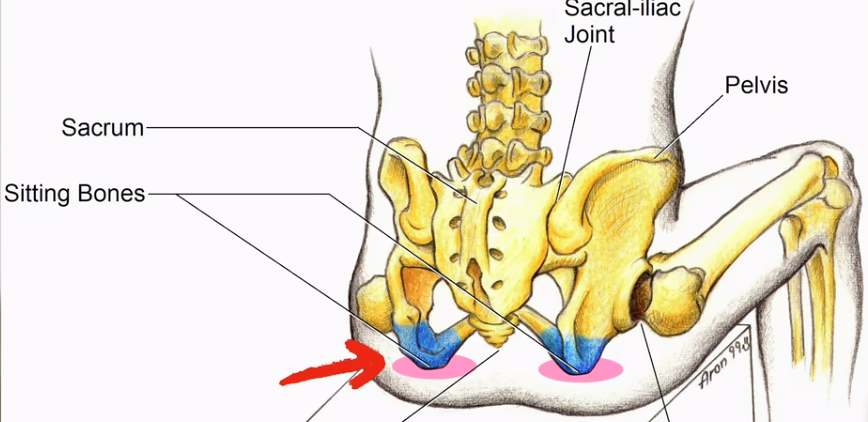
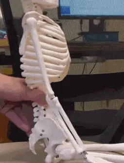
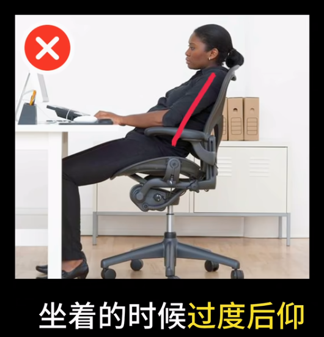
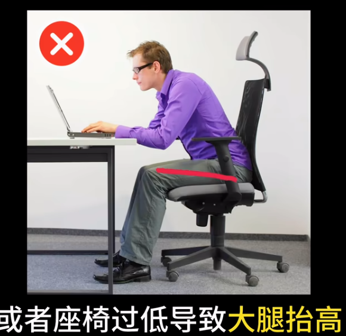
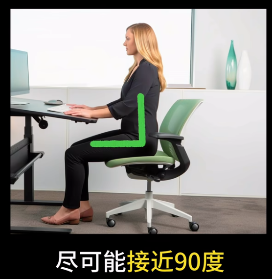
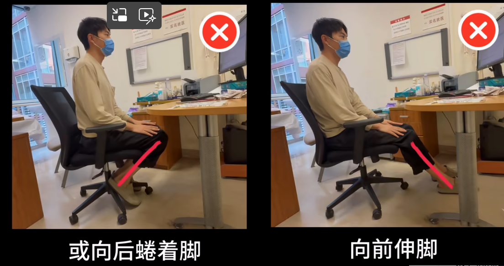
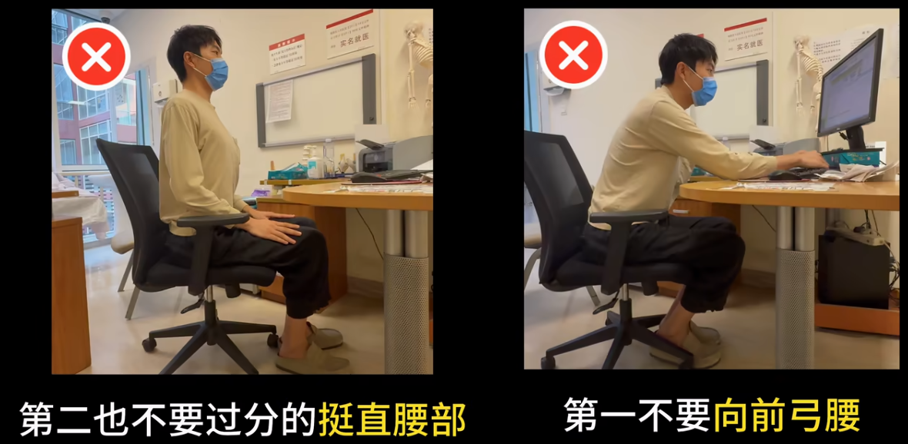
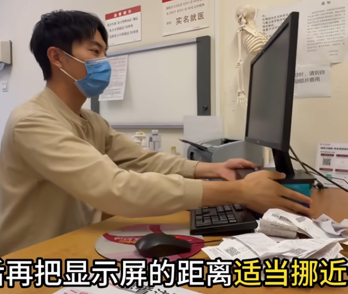
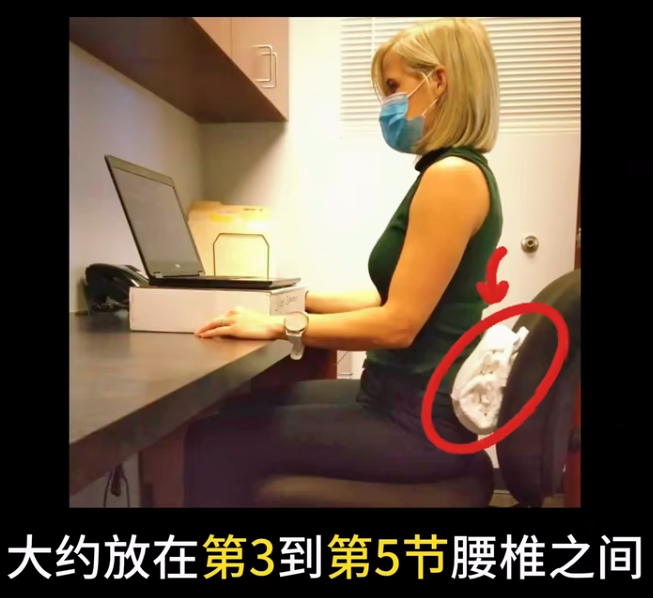
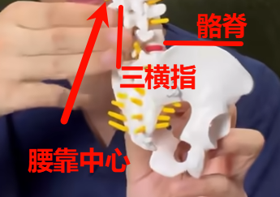

## 正确坐姿的要点、原理及维持方法

[划重点！骨科医生教你正确坐姿_哔哩哔哩_bilibili](https://www.bilibili.com/video/BV1ERgnzYEBe/)

- 坐下 **30 分钟**时应**做简单活动**放松脊柱肌肉
- 坐下 **60 分钟**时应**起身活动**释放椎间盘压力

1. 坐在坐骨结节上
2. 大腿和躯干呈90度
3. 膝关节呈90度，双脚踩实地面
4. 大臂和小臂呈90度

## 避免不良坐姿：塌腰、后仰

> 不良坐姿的长期积累，会导致核心肌肉力量和形态的失衡，进而影响脊柱尤其是颈腰椎的稳定性，最终导致一系列退行性疾病的发生。

## 坐在坐骨结节上

> 要确保脊柱的自然曲度和中立位，想要尽可能减少脊柱的压力，就需要从头到脚的去配合它。

[坐着时](https://www.bilibili.com/video/BV1ERgnzYEBe?t=51.7)，通过前后滚动骨盆，当身体重量坐实在[坐骨结节]( "屁股上两个最硬、最凸起的骨头")上时，骨盆自然摆正，为脊柱提供稳定基座。

## 躯干和大腿的呈 90 度

> 骨盆是连接脊柱和下肢的枢纽，腰部和大腿的很多肌肉都是和骨盆相连的，那么躯干和大腿的位置发生变化，就会影响到骨盆的稳定

**坐着的时候过度后仰或者座椅太高，导致大腿下放**，这两种情况都会导致**骨盆的后倾**，从而就会代偿性的导致腰椎的前凸变小，腰椎后侧的肌肉进一步被拉长并且松弛，而腰椎间盘向后方的挤压力会增大，长期积累就会导致腰肌劳损和腰椎间盘突出。

当**身体过度向前倾斜或者座椅过低、导致大腿抬高，会导致骨盆向前倾斜**，进而导致腰椎的前凸过大，腰椎后方的小关节过度挤压，长期积累可能导致关节源性的疼痛，

**确保躯干和大腿的角度，尽可能使躯干和大腿的角度接近90度**，这个姿态下骨盆更容易维持在中立位，不会由于过多向前或向后的倾斜趋势而导致腰椎的压力增大。

## 大腿小腿呈 90 度，且双脚踩地

> 膝关节的角度会影响大腿后方肌肉的张力，而大腿后方肌肉过度紧张或松弛，也会给骨盆带来前后倾斜的趋势，进而导致腰椎压力的增加

**膝关节（大腿和小腿夹角）维持在90度左右，并且双脚踩实地面支撑重心。**

需要避免向前伸脚或向后蜷着脚，这两个姿态都会通过大腿后方的肌肉张力来影响到骨盆的稳定，进而影响到腰椎的压力。

### 避免向前弓腰、过分挺直腰部

> 不要向前弓腰，会增加椎间盘突出的风险，也不要过分的挺直腰部，这样腰椎后方的浅层肌肉可能会因为过度紧张，导致腰肌劳损

可先坐稳骨盆，自然挺起腰部，在**维持腰椎位置不变的前提下深呼吸，呼气时自然下沉腰部，** 感受到腰椎没有动，但是腰部的肌肉自然下沉，放松下来就找到位置了。

## 应让肘关节尽量靠近身体

> 胸椎的位置主要受肘关节和身体距离的影响，肘关节离身体越远，后背就会越往下拖，在向前伸手的时候，就很难自然的舒展胸椎

关键点就是**让肘关节尽量靠近自己的身体**。有扶手的椅子可将扶手调至胳膊肘高度，肘关节搭在扶手上，无扶手则将键盘挪近，让肘关节不要离身体太远，以舒展胸廓和胸椎。

### 不要让肘关节离肩膀的距离太近

> 肩颈后方肌肉的紧张程度，最主要的影响因素就是肘关节离肩膀的距离，**最佳的状态还是大臂自然下垂，并在手肘给予支撑**

通过调整桌子或座椅高度**避免肘关节离肩膀过近导致耸肩**。同时，将显示屏垫高与视线平齐并适当挪近，**避免向前探头**，维持颈椎中立位。

（显示器垫太高，看的时候向上抬眼可能会更容易眼干）

## 维持最大难度——腰累

> 正确的坐姿下，腰椎很容易疲劳，而把屁股向前划一划，瘫坐在座椅上感觉更加舒适，这是由于正确的坐姿，其实是需要腰部肌肉处于持续而低能量的发力状态

以下提供三种让腰部肌肉更省力的方法：

### 使用腰靠

腰靠的位置大约放在第三到第五节腰椎之间，大概位于骨盆前方最高髂脊的这个水平，再往上三横指左右的距离，作为腰靠的中心。

腰靠不用太厚，只需要填充腰部和椅背的空间贴合，而不是挤压，这样可以减轻腰部肌肉的压力，从而更好地维持腰椎的自然前凸。

### 椅背可以适当的轻微后仰

椅背后仰角度控制在90~100度之间，这样可以一部分卸掉我们腰部肌肉的压力，同时不会过度影响骨盆的位置。

### 增加一个坐垫

> 用坐骨结节坐到硬板凳时，坐骨上过大的压力，可能会增加骨盆向外旋转的趋势，从而导致腰背部肌肉以及骶髂关节的压力增加。

选择一个软硬适中的坐垫，可以减小坐骨的压强，更大的接触面积，可以让臀部的肌肉分散掉坐骨的压力，从而减小骨盆外旋趋势，带来的额外的腰椎和骶髂关节的压力。

另外还**可以选择前高后低，大约5度左右的倾斜角的坐垫**，这个角度可以帮我们更轻松地，维持骨盆的中立位。

## 即使是正确的坐姿，也要避免久坐

> 肌肉疲劳的时间通常在30分钟左右，超过了30分钟，肌肉的支撑力下降，更多的压力就会给到骨质和椎间盘，而椎间盘开始脱水的时间点是一个小时，超过一个小时，椎间盘就会由于过大的压力开始产生形变。

日常办公时要记住这两个时间点：

1. 三十分钟时去做一些简单的活动（最好起身走几步），让我们整个脊柱，尤其是腰椎的肌肉去进行适当的放松，避免肌肉疲劳，恢复支撑力

2. 一个小时时，需要我们站起来去[做一些简单的活动](https://www.bilibili.com/video/BV1Cb7WzaEN5/)，从而释放掉椎间盘的压力

[一分半六个久坐放松动作](https://blog.xqher.cn/post/2025/desk_relief_6_moves_neck_back/)