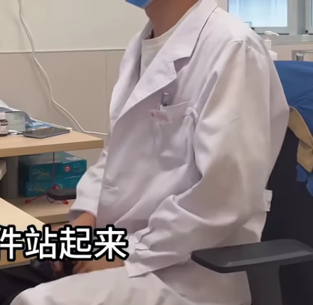
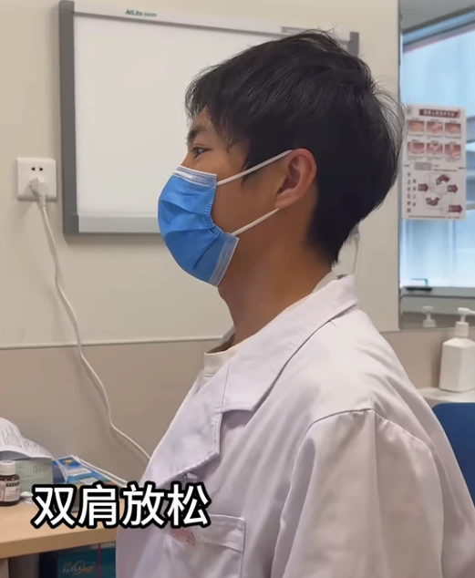
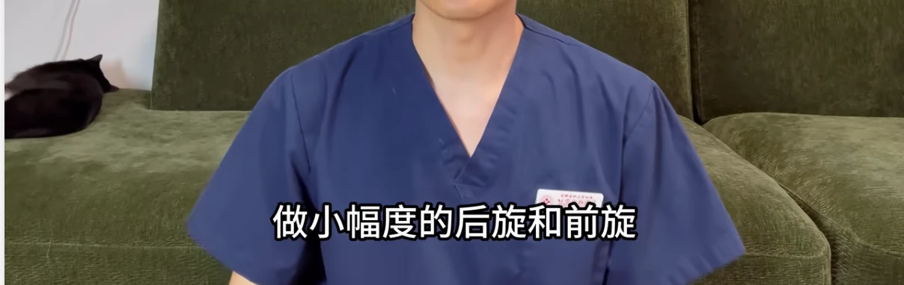
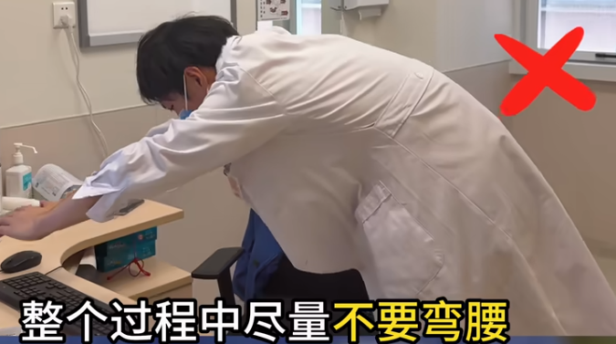
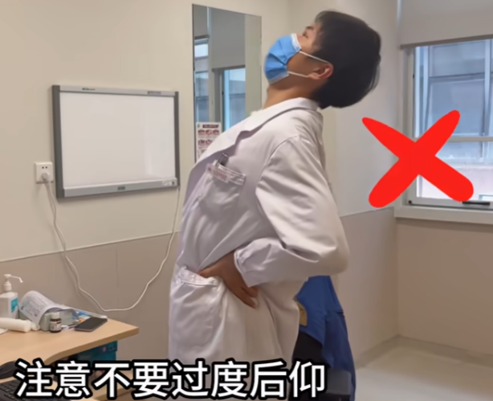
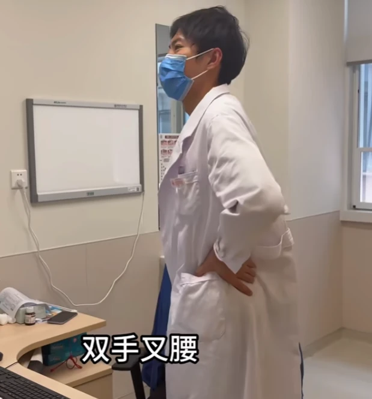
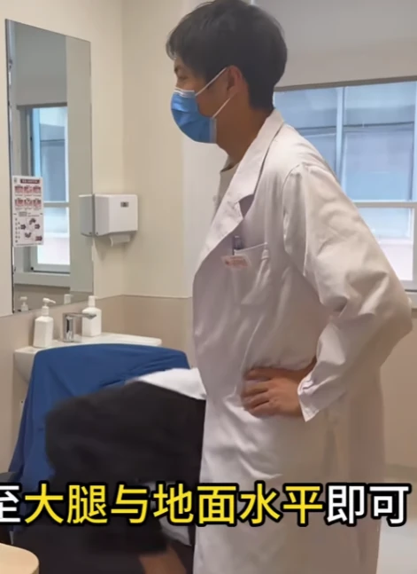
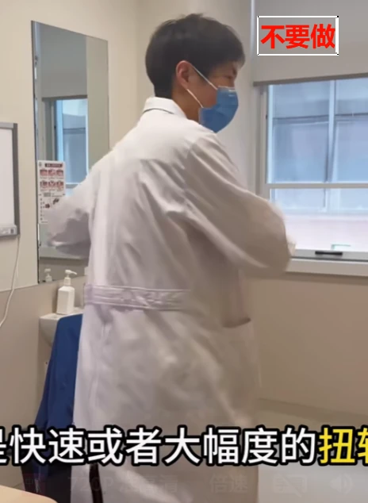

以下内容为[打工人久坐 ｜6 个动作快速缓解颈腰椎压力 | 李款医生 | bilibili](https://www.bilibili.com/video/BV1Cb7WzaEN5/)的视频笔记。

长期久坐风险：颈椎病，腰椎间盘突出，腰椎管狭窄

六个小动作，每个只需 15 秒。

在半个小时这个节点做一些简单的活动，让肌肉放松，恢复它对椎间盘的支撑力。

---

**半个小时时**，有条件的话就**站起来走一走，哪怕只有二三十秒。**

[没有条件站起来](https://www.bilibili.com/video/BV1Cb7WzaEN5?t=80.6)，那就在座位上悬悬肩，动动腿，只要打破一个姿势不动，让肌肉活动起来。

---

在一个小时这个节点，需要全面的伸展和放松整个脊柱，从而释放掉椎间盘的压力。

> 从颈椎到胸椎到腰椎来逐个伸展活动，尽可能的让椎间盘的压力归零

## 第一步做正确的仰头

[自然坐直](https://www.bilibili.com/video/BV1Cb7WzaEN5?t=101.3)，双肩放松，用手向后轻推下巴，做一个微微收下巴的动作，让颈椎回到中立位，然后缓慢匀速地仰头，注意不要仰到极限，用 15 秒做一到两次放松颈椎

> 可能会觉得颈后有响声

[99%的门诊患者都做错的一个动作！_哔哩哔哩_bilibili](https://www.bilibili.com/video/BV1zHRhYhEhv/)

[划重点！骨科医生教你正确坐姿_哔哩哔哩_bilibili](https://www.bilibili.com/video/BV1ERgnzYEBe/)

## 第二步旋肩放松

肩膀[先做小幅度的后旋和前旋](https://www.bilibili.com/video/BV1Cb7WzaEN5?t=117.6)，然后可以用手臂带动肩膀，适当加大幅度，整个过程中保持颈椎处于中立位不动，用肩关节的活动去带动颈部肌肉的放松，一共做15秒

## 第三步站立拉伸弓背

> 这个动作可以通过胸腰段和腰骶段的同时拉伸，来释放腰椎间盘的压力，同时也可以缓解腰背部肌肉的僵硬

[站起来，双手叉腰](https://www.bilibili.com/video/BV1Cb7WzaEN5?t=132.0)，做一个骨盆微微后倾的动作，然后双手伸直向前向下发力，去拉伸弓背，感受胸椎一节一节的逐渐向下卷曲，同时继续保持骨盆后倾，感受尾骨向前向上的发力，整个**过程中尽量不要弯腰**，只去感受胸部和背部的拉伸即可，用15秒时间做一到两次即可

## 第四步站立舒展腰部

[双手叉腰](https://www.bilibili.com/video/BV1Cb7WzaEN5?t=166.1)，双肩放松下沉，微微挺胸，向后舒展腰部，注意不要过度后仰，只需要有轻微的拉伸感就可以做一次，然后再向左和向右去侧方拉伸腰部，三个方向，一共15秒

## 第五步匀速交替高抬腿

[匀速交替高抬腿](https://www.bilibili.com/video/BV1Cb7WzaEN5?t=181.8)，抬高至大腿与地面水平即可，两腿交替做15秒

## 第六步漫步放松

[自然放松的绕着你的工位走一走](https://www.bilibili.com/video/BV1Cb7WzaEN5?t=191.6)，喝口水，看看窗外，放松一下眼睛，然后就可以继续工作了

## 两个需要注意的错误动作

第一就是转头，第二就是快速或者大幅度的扭转腰部，这两个动作都会给椎间盘带来过大的剪切力，在椎间盘已经高负荷受压一个小时，处于一个即将脱水变形的临界状态，再去施加旋转的剪切力，无疑会增加损伤的风险

